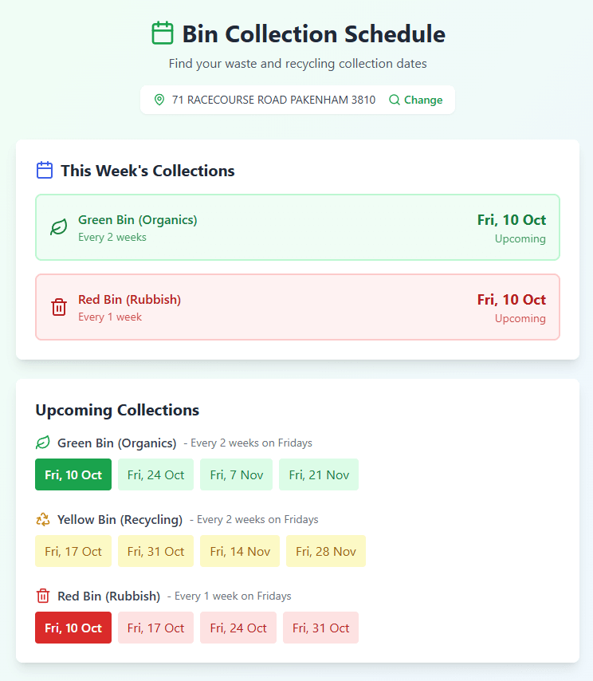

# Cardinia Shire Bin Collection Schedule

PWA web application to check waste and recycling bin collection schedules for Cardinia Shire Council Victorian addresses.

> [!NOTE]
> This project support only the Cardinia Shire Council areas in Victoria, Australia



## Features

- Search by address to find collection zones
- View current week's collections
- See upcoming collection dates for:
  - Green Bin (Organics)
  - Yellow Bin (Recycling)
  - Red Bin (Rubbish)
- Color-coded schedule display
- Automatic calculation based on collection frequency

## Getting Started

### Prerequisites

- Node.js (v16 or higher)
- npm or yarn

### Installation

1. Install dependencies with npm:

```bash
   npm install
```

### Development

Use `dev` script to preview changes with hot-reload. You can use `build` and `preview` npm scripts to build the production ready code and preview the build artifacts.

## Install as Mobile App

Install the Bin Collection Schedule on your phone's home screen for instant access anytime, anywhere.

> [!IMPORTANT]
> Visit: <https://bin-collection.lilanga.me>

### Installation Instructions

#### iPhone (iOS) - Using Safari

- Open Safari Browser

> Must use Safari (not Chrome or other browsers)
> Go to: <https://bin-collection.lilanga.me>

- Tap the Share Button
  - Look at the bottom of your screen
  - Tap the square icon with an arrow pointing up
- Scroll Down in the Menu
  - Look for "Add to Home Screen"
  - Tap it (you may need to scroll down to find it)
- Customize and Add
  - You'll see the app icon and name "Bin Schedule"
  - Tap "Add" in the top-right corner
- Done!
  - Find the app icon on your home screen
  - Tap it to launch the app

#### Android - Using Chrome

- Open Chrome Browser
  - Go to: <https://bin-collection.lilanga.me>

- Open the Menu
  - Tap the three dots (⋮) in the top-right corner

- Select "Add to Home screen" or "Install app"
  - Some phones show "Install app" directly
  - Others show "Add to Home screen"

- Confirm Installation
  - A popup will appear asking to confirm
  - Tap "Add" or "Install"

- Done!
  - Find the app icon on your home screen
  - Tap it to launch the app
